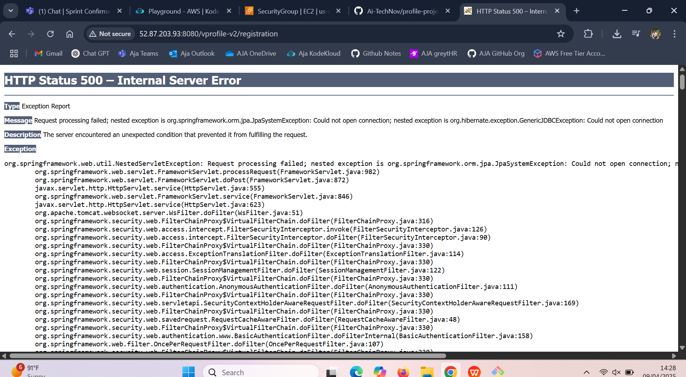
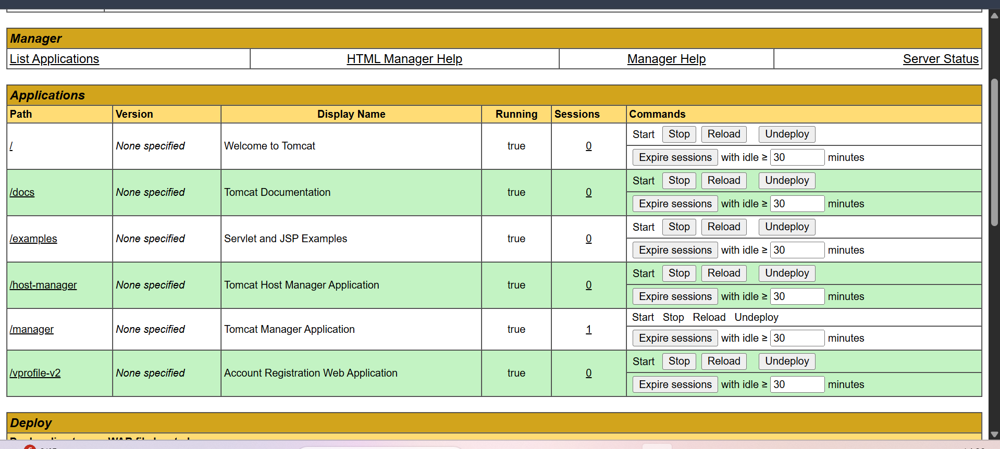

 ## Step-by-Step documentation to Deploy a Java Web Application Using Tomcat 

---

### Launch the EC2 Instance in linux server connect it through the SSH PEM key file 


### 1. **Install the Necessary Software**

First, we need to make sure that the right tools are installed on your server. These tools will help us build and deploy the app.

1. **Install Git**:  
   Git allows you to get the project files from GitHub.  
   Run this command:
   ```bash
   sudo yum install git -y
   ```
   

2. **Install Java**:  
   Java is essential for running Java web applications.  
   Install Java 11 by running:
   ```bash
   sudo yum install java-11 -y
   ```


3. **Install Maven**:  
   Maven is a tool that helps build the project and package it into a .war file, which is the format Tomcat uses to deploy web applications.  
   Install Maven by running:
   ```bash
   sudo yum install maven -y
   ```

---

### 2. **Download and Set Up Apache Tomcat**

Tomcat is the server that will actually run your Java web app. Here’s how to download and set it up:

1. **Download Tomcat**:
   Use this command to download Tomcat 9:
   ```bash
   wget https://dlcdn.apache.org/tomcat/tomcat-9/v9.0.104/bin/apache-tomcat-9.0.104.tar.gz
   ```

2. **Extract the Files**:
   After downloading, you need to extract the Tomcat files:
   ```bash
   tar -xvzf apache-tomcat-9.0.104.tar.gz
   ```

---

### 3. **Clone Your Java Project from GitHub**

Now, you need to get the project files from GitHub.

1. **Clone the Project**:
   Run this command to download the Java project:
   ```bash
   git clone https://github.com/Ai-TechNov/profile-project.git
   cd profile-project/
   ```

This command will download the project and then move you into the project folder.

---

### 4. **Build the Project Using Maven**

Now that we have the project, we need to build it into a format that Tomcat can run.

1. **Build the Project**:
   Run the following command to compile and package the project into a .war file:
   ```bash
   mvn package
   ```

After running this, you’ll find the `.war` file inside the `target/` folder.

---

### 5. **Deploy the WAR File to Tomcat**

The `.war` file is ready, now let’s deploy it on Tomcat.

1. **Copy the WAR File to Tomcat**:
   Move the `.war` file to Tomcat’s `webapps/` folder. Run this command:
   ```bash
   cp -r profile-project/target/*.war apache-tomcat-9.0.104/webapps/
   ```


Tomcat will automatically detect the new `.war` file and deploy it when it starts.

---

### 6. **Configure Tomcat Users (for Web Interface Access)**

You’ll need to set up a user so you can access Tomcat’s web interface.

1. **Edit the User Configuration File**:
   Go to Tomcat’s `conf/` folder:
   ```bash
   cd apache-tomcat-9.0.104/conf/
   ```
   Edit the `tomcat-users.xml` file:
   ```bash
   vi tomcat-users.xml
   ```
2. **Add User Roles**:
   Inside the `<tomcat-users>` tag, add these lines:
   ```xml
   <role rolename="manager-gui"/>
   <role rolename="admin-gui"/>
   <user username="admin" password="admin" roles="manager-gui,admin-gui"/>
   ```

This will allow you to log in to the Tomcat Manager web interface using the username `admin` and password `admin`.

---

### 7. **Allow Access to Tomcat Manager and Host Manager Apps**

By default, Tomcat blocks access to some management tools from remote IPs. To fix this, you need to make changes to two files:

1. **Edit the Host Manager Configuration**:
   ```bash
   cd ../webapps/host-manager/META-INF/
   vi context.xml
   ```

2. **Edit the Manager App Configuration**:
   ```bash
   cd ../../manager/META-INF/
   vi context.xml
   ```

3. **Remove Access Restrictions**:
   In both `context.xml` files, look for this line:
   ```xml
   <Valve className="org.apache.catalina.valves.RemoteAddrValve" allow="127\.\d+\.\d+\.\d+|::1"/>
   ```
   Comment it out or remove it. This will allow you to access Tomcat’s manager from any IP address.


---

### 8. **Start Tomcat**

Now everything is set up, and you can start Tomcat.

1. **Start Tomcat**:
   Go to the `bin/` folder in the Tomcat directory:
   ```bash
   cd ../../../bin/
   ```
   Run the command to start Tomcat:
   ```bash
   ./startup.sh
   ```

---

### 9. **Access Your Application**

Now, open your browser and go to:

```
http://<your-server-ip>:8080
```

You should see your Java web application running in Tomcat!






---

### **Done!**  
Congratulations, we've successfully deployed our Java web application using Tomcat!

### Summary Steps :

1. Launch EC2 Instance & Connect via SSH
Launch an EC2 instance on a Linux server and connect to it using the SSH PEM key.

2. Install Necessary Software
Install Git, Java 11, and Maven on your server. These tools are essential for building and deploying the project.

3. Download and Set Up Apache Tomcat
Download the Tomcat package, extract it, and set up the Tomcat server on your instance.

4. Clone the Java Project from GitHub
Clone your Java project repository from GitHub to the server and navigate to the project directory.

5. Build the Project Using Maven
Use Maven to compile and package the project into a .war file, which Tomcat uses for deployment.

6. Deploy the WAR File to Tomcat
Copy the generated .war file into Tomcat’s webapps/ directory so that Tomcat can deploy it.

7. Configure Tomcat Users for Web Interface Access
Edit Tomcat’s configuration to add user roles for accessing the Tomcat Manager and Admin web interfaces.

8. Start Tomcat and Access the Application
Start Tomcat, then access your deployed Java application by navigating to your server’s IP address in a web browser.