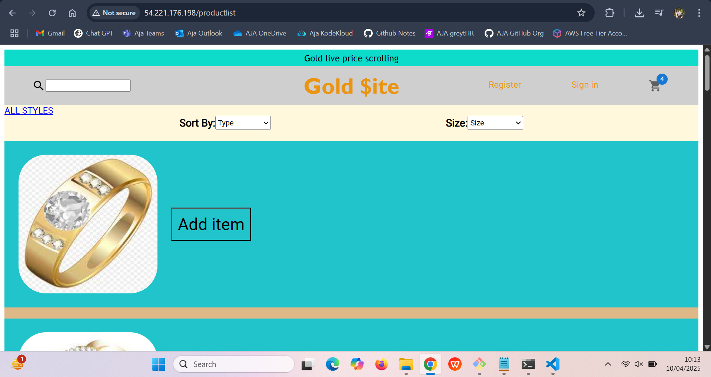
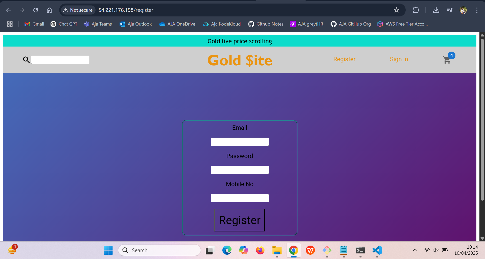

## Deploying a Node.js Website on a Linux Server

### Step-by-Step documentation

---

### Step 1: Update Your System & Install Git

**What to do:**
1. Open the terminal and run the following command:
   ```bash
   sudo apt update
   sudo apt install git -y
   ```

**What this does:**
- `sudo apt update` updates the list of available software updates on your server.
- `sudo apt install git -y` installs **Git**, which you need to get your project from GitHub (like downloading the source code from the internet).

---

### Step 2: Install Node.js and npm

**What to do:**
1. Run the following commands to install **Node.js** and **npm** (Node Package Manager):
   ```bash
   sudo apt install nodejs
   sudo apt install npm
   ```

**What this does:**
- **Node.js** lets you run JavaScript code on your server.
- **npm** is used to manage all the extra tools and libraries your project needs to run.

**To check if Node.js was installed correctly, type:**
```bash
node -v
```

---

### Step 3: Clone Your Project from GitHub

**What to do:**
1. Clone your project using this command:
   ```bash
   git clone https://github.com/akracad/Gold_Site.git
   cd Gold_Site/
   ```

**What this does:**
- `git clone` downloads your project files from GitHub (like a copy of your website code).
- `cd Gold_Site/` moves you into the folder where your project files are saved.

---

### Step 4: Install Project Dependencies

**What to do:**
1. Run this command to install the necessary packages:
   ```bash
   npm install
   ```

**What this does:**
- This command installs all the packages (like React) that your project needs to run.

**If needed:**
- Sometimes, you may need to run this command to install **react-scripts** if it’s missing:
   ```bash
   npm install react-scripts --save
   ```

---

### Step 5: Build the Project

**What to do:**
1. Run the following command to build your project:
   ```bash
   npm run build
   ```

**What this does:**
- This compiles your code into ready-to-use files (HTML, CSS, JavaScript).
- It creates a folder called **build/**, which contains the files your website will use to run.

---

### Step 6: Clean Up (Optional)

**What to do:**
1. Run the command to remove unnecessary files:
   ```bash
   rm -rf Jenkinsfile golddockerfile sonar-project.properties
   ```

**What this does:**
- This deletes any extra configuration files related to continuous integration or Docker, which are not needed for your website to run.

---

### Step 7: Deploy the Website

**What to do:**
1. Copy the build files to the web server's folder using:
   ```bash
   sudo cp -r Gold_Site/build/* /var/www/html/
   ```

**What this does:**
- This command moves the built files (HTML, CSS, JS) to the folder that your web server (like Apache) uses to serve websites. The folder is usually located at `/var/www/html/`.

**If you are not in the project folder anymore, do this first:**
   ```bash
   cd ..
   sudo cp -r Gold_Site/build/* /var/www/html/
   ```

---

### Step 8: Done!

**What to do:**
- Now, open a browser and type your server’s IP address (e.g., `http://your-server-ip`). You should see your website running!

---

### Optional: Install a Web Server (Apache)

If you don’t have a web server like **Apache** installed:

**What to do:**
1. Install Apache with:
   ```bash
   sudo apt install apache2 -y
   ```

2. After installation, restart Apache:
   ```bash
   sudo systemctl restart apache2
   ```






---

## Summary:

- **Step 1:** Update your server and install Git to get the project from GitHub.
- **Step 2:** Install Node.js and npm to run your website and manage dependencies.
- **Step 3:** Clone your project from GitHub.
- **Step 4:** Install the necessary packages for your project.
- **Step 5:** Build the project into static files ready for use.
- **Step 6:** Remove unnecessary configuration files.
- **Step 7:** Copy the build files to the web server folder to make them accessible via the web.
- **Step 8:** Visit your server’s IP address to see your website 